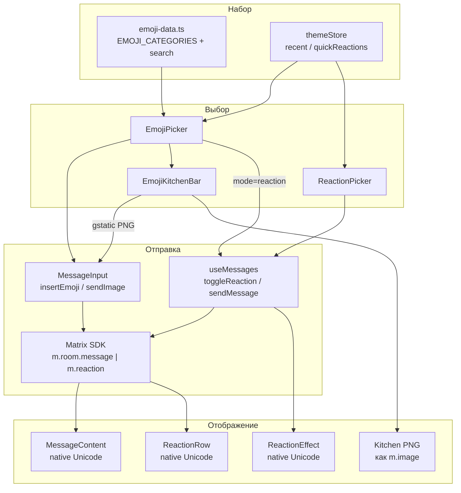

# Emoji в Forta Chat

Гайд по набору emoji, отображению, пикеру, реакциям и Emoji Kitchen: какие библиотеки задействованы и как устроен поток данных.

---

## Кратко

| Слой | Что используется | Как отображается |
|------|------------------|------------------|
| Vue-чат (сообщения, пикер, реакции) | Свой набор Unicode в `emoji-data.ts` | Нативные emoji ОС / WebView (`{{ emoji }}`) |
| Emoji Kitchen (микс двух emoji) | Recipes из `emoji-kitchen-mart` + CDN Google | PNG-картинка, уходит как `m.image` |
| Legacy Bastyon-скрипты (`satolist`) | JoyPixels (`emoji-assets`) | PNG из `public/js/vendor/joypixels/` |

В основном UI чата **нет** замены Unicode на спрайты Twemoji/JoyPixels: в шаблонах рендерится сама строка emoji, вид зависит от шрифтов устройства.

---

## Библиотеки и артефакты

### Runtime-зависимости

| Пакет | Версия | Роль в проекте |
|-------|--------|----------------|
| [`emoji-kitchen-mart`](https://www.npmjs.com/package/emoji-kitchen-mart) | `^6.0.5` | Источник recipe-данных Google Emoji Kitchen. UI-пикер из пакета **не** монтируется — используется только датасет комбинаций (см. ниже). |

### Dev / vendor

| Пакет / файл | Роль |
|--------------|------|
| `emoji-assets` (`6.6.0`, devDependency) | JoyPixels PNG 32×32. Копируются скриптом `scripts/sync-vendor-assets.mjs` в `public/js/vendor/joypixels/png/32` при `postinstall` / `build` / `cap:build`. |
| `public/js/vendor/joypixels.js` | Runtime JoyPixels (`joypixels.toImage(...)`) для legacy-скриптов. |
| `public/js/vendor/emojionearea.js` (+ CSS) | Legacy emoji-area (jQuery). В Vue MessageInput **не** используется. |

### Собственный код (источник истины для Vue-чата)

| Файл | Назначение |
|------|------------|
| `src/shared/lib/emoji-data.ts` | Категории, curated-набор, EN/RU поиск |
| `src/shared/lib/emoji-kitchen.ts` | Lookup комбинаций Kitchen → URL PNG |
| `src/shared/lib/emoji-kitchen-data.json` | Pre-extracted recipes (~2.5 MB), lazy-import |
| `src/features/messaging/ui/EmojiPicker.vue` | Пикер emoji / GIF |
| `src/features/messaging/ui/EmojiKitchenBar.vue` | Полоска комбинаций после выбора emoji |
| `src/features/messaging/ui/ReactionPicker.vue` | Быстрые реакции в контекстном меню |
| `src/features/messaging/ui/ReactionRow.vue` | Чипы реакций под сообщением |
| `src/features/messaging/ui/ReactionEffect.vue` | Полноэкранные анимации реакций |
| `src/features/messaging/model/emoji-insertion.ts` | Вставка emoji в текст с сохранением курсора |
| `src/features/messaging/ui/emoji-picker-layout.ts` | Позиционирование панели (mobile dock / desktop popup) |
| `src/entities/theme/model/stores.ts` | `quickReactions`, `recentEmojis`, `animatedReactions` |

---

## Набор emoji

Набор **не** тянется из emoji-mart / Unicode CLDR целиком. Это curated-список в `EMOJI_CATEGORIES`:

| Категория | Примеры |
|-----------|---------|
| Smileys | 😀 😂 🥰 🤔 … |
| Gestures | 👍 👎 👏 🙏 … |
| Hearts | ❤️ 🧡 💔 … |
| Animals | 🐶 🐱 🦁 … |
| Food | 🍎 🍕 ☕ … |
| Objects | ⚽ 🎸 📱 … |
| Symbols | ✅ ❌ 🔥 ✨ … |

Экспорт `ALL_EMOJIS` — плоский список всех emoji из категорий.

### Поиск

`searchEmojis(query)` в `emoji-data.ts`:

1. Совпадение по **английским** keywords (`EMOJI_KEYWORDS`).
2. Совпадение по **русским** keywords (`EMOJI_KEYWORDS_RU`) — чтобы запросы вроде «сердце» / «огонь» находили emoji.
3. Совпадение по имени категории (EN) и `CATEGORY_KEYWORDS_RU` (RU) — подтягивает всю категорию.

Библиотечный поиск `emoji-kitchen-mart` для пикера **не** используется (он только Latin); локальные индексы закрывают EN + RU.

### Недавние и быстрые реакции

Хранятся в Pinia `useThemeStore` + `localStorage`:

- **`recentEmojis`** — до 24 штук, LRU при `addRecentEmoji()`. Показываются секцией «Recent» в пикере.
- **`quickReactions`** — по умолчанию `["👍", "❤️", "😂", "😮", "😢", "🔥"]`. Настраиваются в Appearance. Рендерятся в `ReactionPicker` / контекстном меню.
- **`animatedReactions`** — вкл/выкл fullscreen-эффектов (`ReactionEffect`).

---

## Отображение

### Текст сообщения

Поток:

```
Matrix event → EventWriter / Dexie → Message.content (string)
  → MessageBubble → MessageContent → parseMessage() → {{ seg.content }}
```

Emoji в тексте — обычные Unicode code points. `MessageContent` парсит ссылки и упоминания, но **не** превращает emoji в ``. Внешний вид = системный emoji-шрифт (Android WebView, iOS, Windows, macOS).

### Пикер и реакции

В `EmojiPicker`, `ReactionPicker`, `ReactionRow` emoji выводятся как текст:

```vue
{{ emoji }}
```

То же для частиц в `ReactionEffect`.

### Legacy (JoyPixels)

Скрипт `loadChatScripts` подгружает `/js/vendor/joypixels`. Старый `satolist.js` вызывает `joypixels.toImage(...)` для HTML-превью. Это путь **legacy Pocketnet/Bastyon UI**, не Vue MessageList.

PNG синхронизируются офлайн (Tor / без CDN):

```
node_modules/emoji-assets/png/32
  → public/js/vendor/joypixels/png/32
```

(`scripts/sync-vendor-assets.mjs`)

---

## Пикер: процесс выбора

### Режимы

`EmojiPicker` принимает `mode`:

| Mode | Где открывается | Поведение |
|------|-----------------|-----------|
| `input` | Кнопка emoji у `MessageInput` | Вкладки Emoji \| GIF, Kitchen bar, после выбора пикер **не** закрывается |
| `reaction` | Контекстное меню / «+» у реакций | Только emoji-grid; после выбора — `close` |

Два инстанса могут сосуществовать в дереве чата (input + reaction). CSS-переменная `--emoji-picker-height` публикуется **только** input-mode на mobile (dock снизу), чтобы `MessageList` поднял контент над панелью. Desktop и reaction-mode переменную не трогают.

### Layout

`emoji-picker-layout.ts`:

- Mobile + `input` → bottom sheet на всю ширину.
- Mobile + `reaction` → компактная панель у якоря.
- Desktop → floating popup у координат кнопки, с clamp к viewport.

### Вставка в поле ввода

```
EmojiPicker @select
  → MessageInput.insertEmoji()
  → insertEmojiAtCursor()   // чистая функция
  → text + cursor + focus
  → mention.onCursorChange()  // тот же pipeline, что у @input
  → themeStore.addRecentEmoji()
```

Важно: раньше мутация `v-model` без re-run input-pipeline «замораживала» поле (WEE-48). Сейчас вставка всегда прогоняет mention/typing side-effects.

### GIF

Вкладка GIF → `GifPicker` → Tenor API → отправка как изображение (`handleGifSelect` → `sendGif`). Это соседняя фича того же пикера, не emoji-набор.

---

## Emoji Kitchen

### Идея

Пользователь выбирает emoji в пикере → внизу появляется горизонтальная полоска возможных **микс-картинок** Google Emoji Kitchen → тап по комбинации шлёт PNG как обычное изображение.

### Данные

1. Из `emoji-kitchen-mart` когда-то извлечены recipes в `emoji-kitchen-data.json`  
   Формат: `Record<unifiedHex, Array<[left, right, date]>>`, например ключ `"1f600"`.
2. `emoji-kitchen.ts` при старте делает lazy `import("./emoji-kitchen-data.json")`.
3. `getKitchenCombos(emoji)` / `getKitchenCombo(a, b)` ищут пары и собирают URL:

```
https://www.gstatic.com/android/keyboard/emojikitchen
  /{date}/u{left}/u{left}_u{right}.png
```

Variation selector `U+FE0F` при маппинге в unified отбрасывается (в датасете его нет).

### UI и отправка

```
EmojiPicker handleSelect(emoji)
  → lastSelectedEmoji
  → EmojiKitchenBar watch → getKitchenCombos (max 30)
  → @select(imageUrl)
  → MessageInput.handleKitchenSelect
  → fetch(imageUrl) → File("emoji-kitchen.png")
  → sendImage(file)   // Matrix media / m.image
```

Нужен доступ к `gstatic.com` (на чистом Tor без cleartext-моста Kitchen-картинки не загрузятся). Сами recipes лежат локально в бандле.

---

## Реакции

### Протокол

Matrix event `m.reaction` с annotation:

```json
{
  "m.relates_to": {
    "rel_type": "m.annotation",
    "event_id": "$targetMessageId",
    "key": "👍"
  }
}
```

`key` — нативная Unicode-строка emoji. Отправка: `matrixService.sendReaction()`. Снятие: `redactEvent` по `myEventId` реакции.

### Клиентский поток

```
UI (ReactionRow / ReactionPicker / EmojiPicker reaction-mode)
  → useMessages.toggleReaction(messageId, emoji)
  → optimisticAdd / optimisticRemove в chatStore
  → sendReaction | redactEvent
  → inbound: EventWriter.writeReaction → Dexie.messages.reactions
  → UI читает message.reactions
```

Правила UX:

- Одна реакция на пользователя на сообщение: смена emoji сначала redacts старую.
- Optimistic UI + `myEventId` после ответа сервера.
- `ReactionRow` показывает до 5 чипов, остальное — `+N`; кнопка `+` скрыта, если у пользователя уже есть реакция.
- Anti-double-fire в `ReactionPicker` (400 ms на тот же emoji).

### Анимация

При toggle / выборе из меню, если `animatedReactions`:

```
lastReactionEmoji = emoji
  → ReactionEffect spawnParticles
  → CSS float-up / fall-down / burst (❤️ 🔥 🎉 👍 😂 / default)
```

Анимация чипа: класс `animate-reaction` (scale pop), уважает `prefers-reduced-motion` и флаг `animationsEnabled`.

---

## Схема потоков



---

## Связанные настройки UI

| Место | Что |
|-------|-----|
| Appearance / Settings | Quick reactions, animated reactions |
| `MessageInput` | Кнопка 😀 → пикер input-mode |
| `MessageContextMenu` | Quick reactions + «ещё emoji» |
| `MessageList` | Reaction-mode пикер, `ReactionEffect`, padding под `--emoji-picker-height` |

---

## Тесты (ориентиры)

| Файл | Что покрывает |
|------|---------------|
| `src/shared/lib/__tests__/emoji-data-search.test.ts` | EN/RU поиск |
| `src/features/messaging/model/__tests__/emoji-insertion.test.ts` | Курсор и вставка |
| `src/features/messaging/ui/__tests__/EmojiPicker-*.test.ts` | Height var, autofocus, sticky headers |
| `src/features/messaging/ui/__tests__/ReactionPicker.test.ts` | Quick reactions / double-fire |
| `src/features/messaging/model/use-messages.test.ts` | `toggleReaction` |
| `src/entities/theme/model/stores.test.ts` | recent / quickReactions |

---

## Частые вопросы

**Почему на Android emoji выглядят иначе, чем на iPhone?**  
Vue-чат рисует native Unicode. Глифы даёт WebView/ОС (Noto Color Emoji, Apple Color Emoji и т.д.), не единый asset-pack.

**Зачем тогда `emoji-assets` / JoyPixels?**  
Для legacy-скриптов Bastyon (`satolist` и связанные виджеты) и офлайн-копии PNG. Новый чат на Vue их для бабблов не вызывает.

**Почему Kitchen — картинка, а не текст?**  
Комбинация Google Kitchen — это сгенерированный PNG, не code point Unicode. Поэтому она уходит как медиа-сообщение.

**Можно ли расширить набор?**  
Добавить Unicode-строки в `EMOJI_CATEGORIES` и (желательно) keywords в `EMOJI_KEYWORDS` / `EMOJI_KEYWORDS_RU`, иначе поиск по новым emoji будет слабым.
