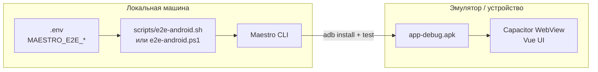

# Maestro E2E на Android-эмуляторе — Implementation Plan

> **For Claude:** REQUIRED SUB-SKILL: Use superpowers:executing-plans to implement this plan task-by-task.
>
> **Контекст:** Дополнение к [android-chat-open-send-fix](2026-06-30-android-chat-open-send-fix.md). Локальная регрессия перед релизом: «чат открылся» и «сообщение ушло» на debug APK в эмуляторе. Приватный ключ тестового аккаунта — в `.env` (не в git).

**Goal:** Три стабильных Maestro-флоу на `app-debug.apk`, запускаемых одной командой после `npm run cap:build`. Покрывают manual test matrix #1, #2, #3 из android-chat-open-send-fix.

**Architecture:**



| Компонент | Роль |
|-----------|------|
| `e2e/maestro/` | YAML-флоу + subflows |
| `scripts/e2e-android.*` | Загрузка `.env`, сборка APK, `maestro test` |
| `data-testid` / `aria-label` | Стабильные селекторы в WebView (минимальный diff в UI) |
| `.env` | `MAESTRO_E2E_PRIVATE_KEY`, имена чатов — **только локально** |

**Tech Stack:** Maestro 1.39+, Capacitor 8, debug APK (`assembleDebug`), ADB, существующие `data-testid` в `ChatWindow.vue`

**Не в scope:** CI на GitHub Actions (отдельный этап), тесты медиа/фото, Tor, звонки, OEM-специфика.

**Связанный план:** [2026-06-30-android-chat-open-send-fix.md](2026-06-30-android-chat-open-send-fix.md) — unit-тесты + manual matrix на реальных устройствах остаются обязательными.

---

## Пререквизиты

### Софт

- [Android Studio](https://developer.android.com/studio) + AVD (рекомендация: **Pixel 6**, API **30** или **33**, Google APIs, x86_64)
- `ANDROID_HOME` / `platform-tools` в PATH (`adb devices` видит эмулятор)
- [Maestro CLI](https://maestro.mobile.dev/getting-started/installing-maestro) ≥ 1.39
- Node 18+, JDK 17+ (как в [android-local-build.md](../android-local-build.md))

### Тестовый аккаунт

1. Выделенный **тестовый** Pocketnet/Bastyon аккаунт (не продовый).
2. У аккаунта уже есть **≥2 чата с историей** (для room-switch) и стабильные display names.
3. Аккаунт **не включал Tor** (e2e идёт через clearnet — проще и быстрее boot).
4. Записать в `.env`:
   - приватный ключ (WIF или hex);
   - точное отображаемое имя чата A и чата B (как в sidebar, locale `en` или `ru` — см. Task 2.2).

### Безопасность `.env`

- `.env` уже в `.gitignore` — **не коммитить**.
- **Не** использовать `VITE_*` для ключа: Vite вшивает `VITE_` в бандл APK при `cap:build`.
- `VITE_DEFAULT_PRIVATEKEY` в `src/shared/config/env.ts` сейчас **нигде не читается** — для e2e не подключать.
- Добавить только `.env.example` с плейсхолдерами (без реальных значений).

---

## Phase 1 — Инфраструктура Maestro

### Task 1.1: Структура каталогов

**Files (create):**

```
e2e/
  maestro/
    config.yaml              # appId, optional tags
    subflows/
      login.yaml             # общий логин
      dismiss-permissions.yaml  # notification / overlay (best-effort)
    flows/
      01-open-chat.yaml      # manual matrix #1
      02-send-text.yaml      # manual matrix #3
      03-room-switch.yaml    # manual matrix #2
  README.md                  # краткая инструкция для разработчика
```

**Step 1:** Создать дерево каталогов.

**Step 2:** `e2e/maestro/config.yaml`:

```yaml
appId: com.forta.chat
```

**Step 3: Commit**

```bash
git commit -m "chore(e2e): add Maestro directory scaffold"
```

---

### Task 1.2: Переменные окружения

**Files:**
- Modify: `.env.example` (создать, если нет)
- Create: `e2e/README.md`

**Step 1:** Добавить в `.env.example`:

```bash
# Maestro Android E2E (local only — copy to .env, never commit)
MAESTRO_E2E_PRIVATE_KEY=
MAESTRO_E2E_TARGET_ROOM=          # display name чата A (с историей)
MAESTRO_E2E_TARGET_ROOM_B=        # display name чата B (для room-switch)
MAESTRO_E2E_LOCALE=en             # en | ru — должен совпадать с селекторами в YAML
```

**Step 2:** Локально создать `.env` из example и заполнить ключ + имена чатов.

**Step 3: Commit** (только `.env.example` + README, не `.env`)

```bash
git commit -m "docs(e2e): document Maestro env vars in .env.example"
```

---

### Task 1.3: npm-скрипты и runner

**Files:**
- Create: `scripts/e2e-android.mjs` (кроссплатформенный Node runner)
- Modify: `package.json` — `"e2e:android"`, `"e2e:android:build"`

**Step 1:** Runner делает:

1. Проверка: `adb devices`, `maestro --version`, наличие `MAESTRO_E2E_PRIVATE_KEY` в `process.env` (загрузить `.env` через `dotenv` **только в devDependency** или простой parse без новой зависимости — читать `.env` построчно).
2. `npm run cap:build` (если флаг `--skip-build` не передан).
3. `cd android && ./gradlew assembleDebug` (Windows: `gradlew.bat`).
4. `adb install -r android/app/build/outputs/apk/debug/app-debug.apk`.
5. `maestro test e2e/maestro/flows/` с пробросом env:
   ```bash
   MAESTRO_E2E_PRIVATE_KEY=... MAESTRO_E2E_TARGET_ROOM=... maestro test ...
   ```

**Step 2:** `package.json`:

```json
"e2e:android:build": "npm run cap:build && cd android && node -e \"require('child_process').execSync(process.platform==='win32'?'gradlew.bat assembleDebug':'./gradlew assembleDebug',{stdio:'inherit',cwd:'android'})\"",
"e2e:android": "node scripts/e2e-android.mjs"
```

**Step 3:** Прогон вручную — ожидание: Maestro стартует, но флоу падают до Phase 2–3 (это ок на этом шаге).

**Step 4: Commit**

```bash
git commit -m "chore(e2e): add local Maestro Android runner script"
```

---

## Phase 2 — Стабильные селекторы в UI

Maestro в Capacitor WebView надёжнее всего матчит **видимый текст** и **accessibility label**. `data-testid` в WebView не всегда виден Maestro — используем комбинацию: текст (i18n) + `aria-label` там, где текста нет.

Уже есть в `ChatWindow.vue`: `data-testid="chat-header"`, `chat-loading`, `chat-select-prompt` — задействовать через assert на исчезновение loading-состояния (косвенно: появление placeholder ввода).

### Task 2.1: Login hooks

**Files:**
- Modify: `src/features/auth/ui/login-form/PrivateKeyInput.vue`
- Modify: `src/features/auth/ui/login-form/LoginForm.vue`

**Step 1:** Добавить `data-testid="e2e-login-key"` на textarea приватного ключа.

**Step 2:** Добавить `data-testid="e2e-login-submit"` на кнопку submit + `aria-label` дублирующий `t('auth.signIn')`.

**Step 3:** Unit-тест не обязателен (тривиальные атрибуты); при желании — snapshot в существующем auth test.

**Step 4: Commit**

```bash
git commit -m "chore(e2e): add login test hooks for Maestro"
```

---

### Task 2.2: Message input hooks + locale для e2e

**Files:**
- Modify: `src/features/messaging/ui/MessageInput.vue`

**Step 1:** На textarea: `data-testid="e2e-message-input"`, `aria-label` = `t('message.placeholder')`.

**Step 2:** На кнопку send (`.send-btn`): `data-testid="e2e-message-send"`, `aria-label="Send message"` (фиксированная EN-строка **только для e2e-стабильности**, не через i18n — иначе RU/EN ломает селекторы).

**Step 3:** В `e2e/README.md` зафиксировать: для стабильных флоу на эмуляторе выставить locale приложения в **en** (Settings → Language) **или** дублировать селекторы в YAML для `ru` через `runFlow` when.

**Step 4: Commit**

```bash
git commit -m "chore(e2e): add message compose test hooks for Maestro"
```

---

### Task 2.3: Contact list — tap по имени чата

**Files:** нет изменений, если `MAESTRO_E2E_TARGET_ROOM` совпадает с `item._title.text`.

**Проверка:** В `ContactList.vue` кнопка комнаты уже имеет `:aria-label` с именем. Maestro:

```yaml
- tapOn:
    text: ${MAESTRO_E2E_TARGET_ROOM}
```

Если virtual scroller не показывает чат — добавить в subflow `scrollUntilVisible` (Maestro) перед tap.

**Fallback (только если scroll не помогает):** `data-testid="e2e-room-item"` + `data-room-name` на кнопку — отложить до первого падения флоу.

---

## Phase 3 — Maestro flows (3 штуки)

Общие константы в subflows:

| Шаг | Timeout | Почему |
|-----|---------|--------|
| После login → ChatPage | 120s | Matrix init + sync на холодном старте |
| После tap room → input visible | 15s | IndexedDB / `MessageList.settled` (WEE-95) |
| После send → текст в ленте | 20s | SyncEngine + Matrix RTT |

### Task 3.1: Subflow `login.yaml`

**File:** `e2e/maestro/subflows/login.yaml`

```yaml
appId: com.forta.chat
---
- launchApp:
    clearState: true
- runFlow: dismiss-permissions.yaml   # optional, ignore failures
# Boot overlay (#011621) — ждём экран логина
- extendedWaitUntil:
    visible: "Sign In"          # en; для ru: "Войти"
    timeout: 60000
- tapOn:
    text: "Private Key or Mnemonic"   # label — фокус на поле; ru: "Приватный ключ или мнемоника"
- inputText: ${MAESTRO_E2E_PRIVATE_KEY}
- hideKeyboard
- tapOn: "Sign In"
- extendedWaitUntil:
    visible: "Message"          # placeholder input = чат-лист загружен
    timeout: 120000
```

**Вариант «уже залогинен»** (быстрый прогон без `clearState`): отдельный subflow `launch-logged-in.yaml` — `launchApp` без clear, assert сразу `Message` или список чатов. Использовать в итерациях разработки флоу.

**Commit:** `chore(e2e): add Maestro login subflow`

---

### Task 3.2: Flow `01-open-chat.yaml` — manual matrix #1

**Сценарий:** Cold start → login → tap чат с историей → лента открылась, нет вечного skeleton.

**File:** `e2e/maestro/flows/01-open-chat.yaml`

```yaml
appId: com.forta.chat
---
- runFlow: ../subflows/login.yaml
- tapOn:
    text: ${MAESTRO_E2E_TARGET_ROOM}
# Sidebar ушёл — виден header или input (mobile layout)
- extendedWaitUntil:
    visible: "Message"
    timeout: 15000
# Не должны застрять на loading skeleton дольше timeout
- assertNotVisible:
    text: "chat-loading"   # если skeleton имеет видимый текст; иначе — assert header back button
    optional: true
```

**Уточнение при реализации:** если `MessageSkeleton` не имеет текста — заменить assert на:
- `extendedWaitUntil: visible: "Send message"` (aria-label кнопки из Task 2.2), или
- проверку что **нет** двух панелей sidebar одновременно (tap back не виден пока в sidebar).

**Критерий PASS:** placeholder `Message` виден ≤15 с после tap; нет экрана «Select a chat» (`chat-select-prompt`).

**Commit:** `test(e2e): Maestro flow open chat from sidebar`

---

### Task 3.3: Flow `02-send-text.yaml` — manual matrix #3

**Сценарий:** Login → open room → уникальное сообщение → видно в ленте, нет `failed` индикатора.

**File:** `e2e/maestro/flows/02-send-text.yaml`

```yaml
appId: com.forta.chat
---
- runFlow: ../subflows/login.yaml
- tapOn:
    text: ${MAESTRO_E2E_TARGET_ROOM}
- extendedWaitUntil:
    visible: "Message"
    timeout: 15000
- tapOn: "Message"
- inputText: "E2E ping ${/(.*)/ => new Date().toISOString()}"
- hideKeyboard
- tapOn: "Send message"
- extendedWaitUntil:
    visible: "E2E ping"
    timeout: 20000
```

**Примечание:** синтаксис динамической строки уточнить по [Maestro JS expressions](https://maestro.mobile.dev/advanced/javascript); fallback — фиксированный текст `E2E ping 2026-06-30` + `maestro test --include-tags=send` при отладке.

**Критерий PASS:** текст bubble виден; повторный прогон с тем же текстом допустим.

**Commit:** `test(e2e): Maestro flow send text message`

---

### Task 3.4: Flow `03-room-switch.yaml` — manual matrix #2

**Сценарий:** Чат A → back → чат B → input виден, нет пустого экрана.

**File:** `e2e/maestro/flows/03-room-switch.yaml`

```yaml
appId: com.forta.chat
---
- runFlow: ../subflows/login.yaml
- tapOn:
    text: ${MAESTRO_E2E_TARGET_ROOM}
- extendedWaitUntil:
    visible: "Message"
    timeout: 15000
- pressKey: back    # Android back → sidebar (ChatPage handler)
- extendedWaitUntil:
    visible: ${MAESTRO_E2E_TARGET_ROOM}
    timeout: 5000
- tapOn:
    text: ${MAESTRO_E2E_TARGET_ROOM_B}
- extendedWaitUntil:
    visible: "Message"
    timeout: 15000
```

**Требование к данным:** `TARGET_ROOM` и `TARGET_ROOM_B` — разные комнаты, обе с историей.

**Commit:** `test(e2e): Maestro flow room switch without empty screen`

---

### Task 3.5: Subflow `dismiss-permissions.yaml`

**File:** `e2e/maestro/subflows/dismiss-permissions.yaml`

Best-effort tap на системные диалоги (POST_NOTIFICATIONS и т.д.):

```yaml
---
- tapOn:
    text: "Allow"
    optional: true
- tapOn:
    text: "Разрешить"
    optional: true
```

**Commit:** `chore(e2e): optional permission dismiss subflow`

---

## Phase 4 — Локальный workflow перед релизом

### Task 4.1: Чеклист разработчика

Добавить в `e2e/README.md`:

```bash
# 1. Заполнить .env (ключ + имена чатов)
# 2. Запустить эмулятор (Android Studio → Device Manager)
adb devices

# 3. Полный прогон (сборка + install + 3 флоу)
npm run e2e:android

# 4. Быстрый повтор без пересборки
node scripts/e2e-android.mjs --skip-build

# 5. Один флоу
maestro test e2e/maestro/flows/01-open-chat.yaml
```

### Task 4.2: Интеграция в Definition of Done релиза

В [android-chat-open-send-fix](2026-06-30-android-chat-open-send-fix.md) (или RELEASE.md) добавить пункт:

- [ ] `npm run e2e:android` зелёный на эмуляторе API 30+
- [ ] Manual matrix #1–6 на ≥2 реальных устройствах (без изменений)

### Task 4.3: Отладка падений

| Симптом | Действие |
|---------|----------|
| Timeout на login | Chrome `chrome://inspect` → WebView; смотреть `matrixReady`, boot overlay |
| Timeout после tap room | Лог `[MessageList] settled safety timeout`; увеличить wait в YAML до 20s временно |
| Send не виден | `chrome://inspect` → `pendingOps` в IndexedDB |
| Не находит имя чата | Проверить `MAESTRO_E2E_TARGET_ROOM` vs реальный title; locale en/ru |
| Flaky permissions | Добавить шаги в `dismiss-permissions.yaml` |

**Commit:** `docs(e2e): add local runbook and release checklist hook`

---

## Phase 5 — Верификация плана

### Task 5.1: Прогон на чистом эмуляторе

1. Wipe data эмулятора / `clearState: true`.
2. `npm run e2e:android` — все 3 флоу green.
3. Повтор без wipe (`--skip-build`) — optional logged-in path.

### Task 5.2: Регрессия unit-тестов

```bash
npm run build
npm run test
```

UI hooks не должны ломать существующие тесты.

### Task 5.3: Code review

- `review` — достаточно для этого объёма.

---

## Порядок выполнения

```
Phase 1 (1.1 → 1.3)   scaffold + runner
    ↓
Phase 2 (2.1 → 2.2)   test hooks в UI
    ↓
Phase 3 (3.5 → 3.1 → 3.2 → 3.3 → 3.4)   subflows, затем флоу по одному
    ↓
Phase 4               документация + release hook
    ↓
Phase 5               полный прогон
```

**Правило:** один task = один коммит (`chore(e2e):`, `test(e2e):`, `docs(e2e):`).

---

## Worktree

По `CLAUDE.md` — реализацию вести в **изолированном git worktree** (`isolation: worktree`), чтобы не конфликтовать с параллельным фиксом android-chat-open-send.

---

## Definition of Done

- [ ] `.env.example` с `MAESTRO_E2E_*` (без секретов в git)
- [ ] `npm run e2e:android` собирает debug APK, ставит на эмулятор, гоняет 3 флоу
- [ ] Флоу `01-open-chat`, `02-send-text`, `03-room-switch` стабильно green на API 30+ эмуляторе (≥2 прогона подряд)
- [ ] Приватный ключ **не** попадает в APK / git / CI logs
- [ ] `npm run build` + `npm run test` без регрессий
- [ ] `e2e/README.md` с инструкцией для Windows + macOS

---

## Будущее (не в этом плане)

| Улучшение | Когда |
|-----------|-------|
| CI: `reactivecircus/android-emulator-runner` + Maestro | После 2 недель стабильных локальных прогонов |
| Флоу #5–6 (background 2 min, airplane mode) | Отдельный план; нужны `adb shell` / Maestro `runScript` |
| Mock Matrix / staging homeserver | Если понадобится изоляция от прод-сети |
| `detox` / Appium | Не рекомендуется — Capacitor + Maestro проще |

---

## Ссылки на код (якоря)

| Модуль | Путь |
|--------|------|
| Login UI | `src/features/auth/ui/login-form/LoginForm.vue` |
| Private key input | `src/features/auth/ui/login-form/PrivateKeyInput.vue` |
| Room list tap | `src/features/contacts/ui/ContactList.vue` → `handleSelect` |
| Mobile sidebar/chat | `src/pages/chat/ChatPage.vue` → `showSidebar` |
| Chat loading state | `src/widgets/chat-window/ChatWindow.vue` → `chat-loading` |
| Message list settled | `src/features/messaging/ui/MessageList.vue` → `settled` |
| Compose + send | `src/features/messaging/ui/MessageInput.vue` → `handleSend` |
| Android back | `src/pages/chat/ChatPage.vue` → `useAndroidBackHandler` |
| Debug APK build | `docs/android-local-build.md` |
| Env (не использовать для ключа в Vite) | `src/shared/config/env.ts` |
