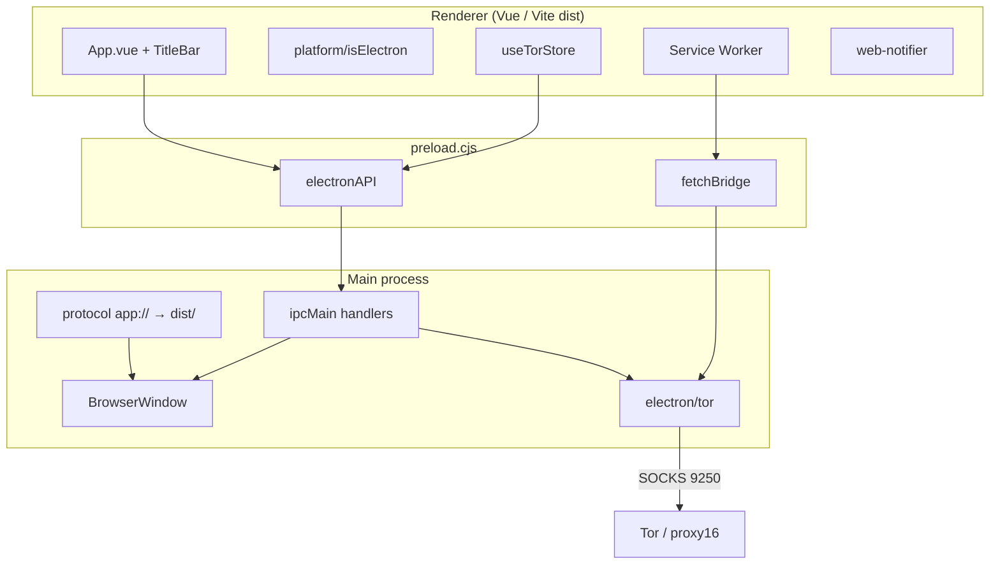

# План: Forta Chat как desktop-приложение (Electron)

**Дата:** 2026-07-21  
**Статус:** MVP уже в репозитории; план доводит Win / macOS / Linux до production-ready  
**Стек:** Vue 3 + Vite + Electron 40 + electron-builder 26  
**Связанные документы:**
- [tor/forta-chat-tor-integration-plan.md](../tor/forta-chat-tor-integration-plan.md) — Tor в Electron (proxy16, SW fetch bridge)
- [2026-03-19-capacitor-mobile-app-design.md](../2026-03-19-capacitor-mobile-app-design.md) — platform abstraction (`isElectron` / `isNative` / `isWeb`)

---

## Цель

Один и тот же Vue-фронт (`src/`) работает как:

| Канал | Оболочка |
|-------|----------|
| Web | браузер |
| Android | Capacitor |
| **Desktop** | **Electron (Win / macOS / Linux)** |

**Core value:** пользователь ставит Forta Chat как обычное приложение ОС — с установщиком, автообновлениями, системными уведомлениями, Tor и тем же чатом, что в вебе/на Android.

---

## Текущее состояние (уже реализовано)

### Слой Electron (main / preload)

| Компонент | Статус | Путь |
|-----------|--------|------|
| Main process, frameless window | ✅ | `electron/main.cjs` |
| Preload + `contextBridge` (`electronAPI`, `fetchBridge`) | ✅ | `electron/preload.cjs` |
| Схема `app://` для prod (нужна для Service Worker) | ✅ | `electron/main.cjs` |
| Dev: Vite HMR через `VITE_DEV_SERVER_URL` | ✅ | `npm run electron:dev` |
| Window controls IPC (min / max / close) | ✅ | main + preload |
| Native save dialog (`file:save`) | ✅ | main + `use-file-download.ts` |
| External links → системный браузер | ✅ | `setWindowOpenHandler` |
| Tor stack (proxy16, SOCKS, Snowflake opt-in) | ✅ | `electron/tor/` |
| Session SOCKS proxy при Tor `started` | ✅ | `electron/main.cjs` |
| SW ↔ Main fetch bridge | ✅ | `fetchBridge`, `public/service-worker.js` |

### Renderer / Vue

| Компонент | Статус | Путь |
|-----------|--------|------|
| Platform helpers | ✅ | `src/shared/lib/platform/index.ts` |
| Custom TitleBar (Win/Linux + macOS traffic lights) | ✅ | `src/widgets/title-bar/TitleBar.vue` |
| CSS hooks `is-electron` / `is-electron-mac` | ✅ | `App.vue` |
| Tor UI + store (Electron path) | ✅ | `entities/tor`, Settings |
| Transport init в Electron | ✅ | `app/providers/index.ts` → `initTransport()` |
| Desktop notifications (Web Notification API) | ✅ | `shared/lib/notifications/web-notifier.ts` |

### Сборка и упаковка

| Компонент | Статус | Путь / команда |
|-----------|--------|----------------|
| `package.json` → `"main": "electron/main.cjs"` | ✅ | |
| Scripts `electron:dev` / `preview` / `build:{win,mac,linux}` | ✅ | `package.json` |
| electron-builder config | ✅ | `electron-builder.json` |
| Targets: NSIS+zip / DMG+zip / AppImage+deb | ✅ | |
| Артефакты в `release/` (в `.gitignore`) | ✅ | |

### Быстрый старт (уже работает)

```bash
# Dev с HMR
npm run electron:dev

# Prod-сборка в окне Electron (без installer)
npm run electron:preview

# Installers
npm run electron:build:win    # NSIS + zip
npm run electron:build:mac    # DMG + zip (нужен macOS)
npm run electron:build:linux  # AppImage + deb
```

---

## Архитектура



**Принципы (не ломать):**
1. **Один UI-код** — без копирования экранов под desktop; ветки только через `isElectron` / `hasTor`.
2. **Security baseline** — `contextIsolation: true`, `nodeIntegration: false`, узкий preload API.
3. **Tor parity с Android** — маршрутизация через общий `routing.ts` + SW; детали в Tor-плане.
4. **Не пересекаться** с Android keyboard-работой другого разработчика.

---

## Gap analysis — что ещё нужно для «настоящего» приложения

| Область | Сейчас | Нужно |
|---------|--------|-------|
| TypeScript типы `window.electronAPI` | `(window as any)` | `src/shared/types/electron.d.ts` |
| Иконки installer / tray | один `public/forta-icon.png` | `.ico` (Win), `.icns` (mac), набор PNG (Linux/tray) |
| Code signing | нет | Win Authenticode + mac Developer ID + notarize |
| Auto-update | нет | `electron-updater` + publish (GitHub Releases / S3) |
| CI desktop builds | нет (`.github` без electron) | matrix Win/macOS/Linux runners |
| Deep links | нет | `forta://` / `https://forta.chat/...` → open room |
| System tray / close-to-tray | нет | опционально, UX как у мессенджеров |
| Single instance | нет | `requestSingleInstanceLock` |
| `asar` | `false` | оценить `true` + unpack Tor binaries |
| Entitlements macOS | нет | Hardened Runtime для Tor spawn + WebRTC |
| Desktop smoke tests | unit вокруг platform mocks | e2e / smoke checklist + CI artifact smoke |
| Документация пользователя | нет | install / update / Troubleshoot Gatekeeper & SmartScreen |

---

## Фазы внедрения

### Фаза 0 — Зафиксировать baseline (1–2 дня)

**Цель:** любой разработчик поднимает desktop за <15 минут, без сюрпризов.

- [x] README-секция Desktop (или этот каталог как source of truth)
- [ ] Проверить `electron:dev` / `electron:preview` на Win (основная машина команды)
- [x] Чеклист smoke: логин → список чатов → отправка → файл → звонок → Tor toggle
- [x] Добавить `src/shared/types/electron.ts` и убрать `(window as any).electronAPI` в горячих местах
- [x] Unit-тесты на platform helpers + preload-shaped mock
- [x] `requestSingleInstanceLock()` + focus existing window (часть Phase 1, сделано рано)

**Критерий готовности:** `npm run electron:dev` стабилен; типы компилируются; smoke пройден на Win.

---

### Фаза 1 — Packaging hardening (2–4 дня)

**Цель:** корректные installers без signing (для внутренних сборок).

- [x] Сгенерировать иконки: `build/icon.png` (+ `icons/512x512.png`); `.ico`/`.icns` генерит electron-builder
- [x] Обновить `electron-builder.json`:
  - Tor binaries в userData (не asar) — `extraResources` не нужны
  - `artifactName`: `${productName}-${version}-${os}-${arch}.${ext}`
  - `publish: null` пока нет update-сервера
- [x] Включить `asar: true` (Tor download → userData; см. `build/README.md`)
- [x] `requestSingleInstanceLock()` + focus existing window
- [x] macOS: `entitlements.mac.plist` (spawn Tor, camera/mic для звонков)
- [ ] Linux: проверить AppImage на Ubuntu 22.04+ и `.deb` зависимости
- [x] Не ломать `electron:build:*` scripts (`vite build` + electron-builder; Win NSIS проверен)

**Критерий готовности:** локально собираются Win NSIS, Linux AppImage; mac DMG — на mac-runner/машине.

> Win NSIS + zip собраны локально (`Forta Chat-1.11.0-win-x64.*` в `release/`). Linux/mac — на соответствующих runners.

---

### Фаза 2 — Desktop UX parity (3–5 дней)

**Цель:** поведение «как мессенджер», не «как сайт в окне».

| Фича | Подход | Статус |
|------|--------|--------|
| Close → tray (опция) | Tray + `close` → `hide`; Quit из меню tray | ✅ |
| Badge / unread | `app.setBadgeCount` + `useElectronUnreadBadge` | ✅ |
| Notifications | Web Notification + click → focus + `processPushOpenRoom` | ✅ |
| Deep link `forta://room/<id>` | `setAsDefaultProtocolClient` + `open-url` / `second-instance` argv | ✅ |
| Open at login | `app.setLoginItemSettings` (Settings → Desktop) | ✅ |
| Zoom / a11y | Ctrl/Cmd +/- / 0 через `webContents.setZoomFactor` | ✅ |
| DevTools | только dev / `FORTA_DEVTOOLS=1` / `--devtools` | ✅ |

**Не делать в этой фазе:** полный порт Capacitor Push/FCM — на desktop достаточно in-app + OS notifications при запущенном приложении.

**Критерий готовности:** deep link открывает комнату; tray/quit предсказуемы; уведомление кликабельно.

---

### Фаза 3 — Auto-update + подпись (1–2 недели, зависит от сертификатов)

**Цель:** пользователи получают обновления без ручной переустановки.

1. **Зависимости:** `electron-updater` (рядом с electron-builder 26).
2. **Main:** `autoUpdater.checkForUpdatesAndNotify()` после `ready`; UI-события в renderer через IPC (`update:available`, `update:downloaded`).
3. **Publish provider** (выбрать один):
   - GitHub Releases (проще для OSS/внутреннего)
   - Generic HTTP / S3 (если свой CDN)
4. **Signing:**
   - Windows: OV/EV или Azure Trusted Signing (`CSC_LINK` / Azure env)
   - macOS: Developer ID Application + notarize (`APPLE_ID`, `APPLE_APP_SPECIFIC_PASSWORD`, `APPLE_TEAM_ID`)
   - Linux: опционально GPG для `.deb`
5. **`forceCodeSigning: true`** только на release CI job, не на PR unsigned smoke builds.

**Критерий готовности:** установка vN → публикация vN+1 → приложение предлагает обновиться и перезапускается.

---

### Фаза 4 — CI/CD (3–5 дней)

**Цель:** каждый tag / release собирает артефакты автоматически.

```yaml
# Эскиз .github/workflows/desktop-release.yml
strategy:
  matrix:
    include:
      - os: windows-latest
        cmd: npm run electron:build:win
      - os: macos-latest
        cmd: npm run electron:build:mac
      - os: ubuntu-latest
        cmd: npm run electron:build:linux
```

- [ ] Job `desktop-smoke` на PR: `vite build` + запуск electron headless-check (или хотя бы `electron:preview` timeout smoke)
- [ ] Job `desktop-release` на tag `v*`: matrix + upload artifacts / GitHub Release
- [ ] Secrets: signing + Apple notarize
- [ ] Кэш `electron` download + `node_modules`
- [ ] Не смешивать с Android `cap:build` в одном job

**Критерий готовности:** tag создаёт скачиваемые installer’ы для трёх ОС.

---

### Фаза 5 — QA, регрессии, документация (параллельно с 2–4)

#### Автотесты (обязательны по правилам репо)

- [ ] `electron.d.ts` + type-level / platform unit tests
- [ ] Тесты IPC-контракта (mock preload shape)
- [ ] Регрессия file download Electron path (`use-file-download` уже частично покрыт)
- [ ] Tor routing unit tests не ломаются при desktop flags

#### Manual matrix

| Сценарий | Win 10/11 | macOS 13+ | Ubuntu 22.04 |
|----------|-----------|-----------|--------------|
| Install / uninstall | ☐ | ☐ | ☐ |
| Login + sync | ☐ | ☐ | ☐ |
| Send text / media | ☐ | ☐ | ☐ |
| Voice/video call (mic/cam permission) | ☐ | ☐ | ☐ |
| Tor Never / Auto / Always | ☐ | ☐ | ☐ |
| Offline → online SyncEngine | ☐ | ☐ | ☐ |
| Update from previous build | ☐ | ☐ | ☐ |
| Deep link cold/warm start | ☐ | ☐ | ☐ |

#### Доки

- [ ] `docs/plans/electron/user-install.md` — как поставить, обойти SmartScreen/Gatekeeper до появления подписи
- [ ] Changelog desktop в release notes

---

## Структура файлов (целевая)

```
forta.chat/
├── electron/
│   ├── main.cjs                 # window, protocol, IPC, tray, deep links
│   ├── preload.cjs              # electronAPI + fetchBridge
│   ├── desktop-settings.cjs     # close-to-tray / open-at-login persistence
│   ├── deep-links.cjs           # forta:// argv helpers
│   ├── tray.cjs                 # system tray
│   ├── tor/                     # уже есть
│   └── entitlements.mac.plist   # фаза 1
├── build/
│   └── icons/                   # ico / icns / png
├── electron-builder.json
├── src/shared/types/electron.ts
├── docs/plans/electron/
│   ├── README.md
│   ├── electron-desktop-integration-plan.md   ← этот файл
│   └── packaging-checklist.md
└── .github/workflows/
    └── desktop-release.yml      # фаза 4
```

---

## Риски и ограничения

| Риск | Митигация |
|------|-----------|
| Tor binaries + `asar` | `asarUnpack` / `extraResources`; не упаковывать исполняемые в asar blindly |
| macOS notarize ломает spawn Tor | entitlements: `disable-library-validation` / allow dyld — как у аналогов с sidecar binaries |
| WebRTC / устройства | явные permission handlers в main (`setPermissionRequestHandler`) |
| Двойной proxy (session SOCKS + SW bridge) | не менять маршрутизацию без сверки с Tor-планом; регрессия Tor Always |
| Cross-compile mac с Win | **нельзя** полноценно; mac-сборки только на macOS runner |
| Размер артефакта (~150–200MB+) | принять; не минифицировать Electron runtime |
| Параллельная работа над Android keyboard | не трогать Capacitor keyboard / `--keyboardheight` |

---

## Порядок коммитов (ориентир)

Conventional Commits:

1. `chore(electron): add electron API typings and platform test coverage`
2. `fix(electron): single-instance lock and icon assets for installers`
3. `feat(electron): tray, deep links, and notification click focus`
4. `feat(electron): auto-updater wiring`
5. `ci: desktop release workflow for win/mac/linux`
6. `docs(electron): install and packaging checklist`

Каждый коммит — после `npm run build`, `lint`, `vue-tsc`, `test` (правила репо).

---

## Вне скоупа этого плана

- iOS Capacitor
- Переписывание UI под «нативный» desktop framework (Tauri/Flutter) — остаёмся на Electron
- Server-side push для desktop (APNs/WNS) — отдельный эпик, если понадобится notify при закрытом приложении
- Рефакторинг Tor ради рефакторинга — только фиксы, ломающие desktop

---

## Definition of Done (весь эпик)

1. Пользователь скачивает installer Win / macOS / Linux с release page.
2. Приложение устанавливается без ручной сборки из исходников.
3. Чат, медиа, звонки и Tor работают на трёх ОС (smoke matrix).
4. Подписанные сборки (хотя бы mac notarized + win signed) или явно задокументирован временный unsigned путь.
5. Auto-update доставляет патч-версии.
6. CI публикует артефакты с тега.
7. Есть типы, тесты на desktop-ветки и план/чеклист в `docs/plans/electron/`.
