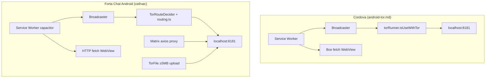

# План интеграции Tor в Forta Chat

**Дата:** 2026-07-14  
**Статус:** MVP реализован (фазы 0–6); остаётся manual QA и мелкие хвосты  
**Референс:** [android-tor.md](./android-tor.md) — как Tor работает в Cordova-сборке Bastyon/PocketNet  
**Связанные документы:** `docs/plans/2026-03-19-capacitor-mobile-app-design.md`, `docs/plans/2026-03-20-tor-status-mobile-design.md`, `docs/plans/2026-03-27-tor-graceful-degradation-plan.md`

---

## Цель

Довести Tor в Forta Chat (Vue 3 + Capacitor + Electron) до функционального паритета с Cordova-приложением: **весь HTTP(S)-трафик WebView при включённом Tor** маршрутизируется через локальный reverse-proxy `http://127.0.0.1:8181`, с управляемыми режимами, мостами и понятным UI.

**Core value:** пользователь на Android (и Electron) получает тот же уровень анонимности, что и в PocketNet — без блокировки входа в приложение, если Tor долго бутстрапится.

---

## Текущее состояние (реализовано)

### Нативный слой Android (Capacitor)

| Компонент | Статус | Путь |
|-----------|--------|------|
| Capacitor-плагин `Tor` | ✅ | `android/.../plugins/tor/TorPlugin.kt` |
| Запуск `libtor.so` + bootstrap | ✅ | `TorManager.kt`, `ProcessRunner.kt` |
| Reverse proxy `libreverseproxy.so` на порту **8181** | ✅ | `TorManager.startReverseProxy()` |
| SOCKS **9051**, Control **9251** | ✅ | `ConfigurationManager.kt` |
| Мосты Snowflake / obfs4 в torrc | ✅ | `ConfigurationManager.generateTorrc()` |
| `isUseWithTor(url)` + режим AUTO (ping хоста) | ✅ | `TorPlugin.kt`, `TorRouteDecider.kt` |
| `getSettings()` — mode / bridgeType / isReady | ✅ | `TorPlugin.kt` |
| Верификация Tor (check.torproject.org + fallback) | ✅ | `TorPlugin.verifyTor()` |
| Очистка кэша Tor | ✅ | `TorPlugin.clearTorCache()` |
| Файловый upload/download через 8181 | ✅ | `TorFilePlugin.kt` |

Плагины зарегистрированы в `MainActivity.kt`.

> **Примечание:** `TorMode` в `generateTorrc()` не влияет на torrc — NEVER/AUTO/ALWAYS решаются в `TorRouteDecider` и JS-whitelist (как в Cordova: routing ≠ daemon config).

### JavaScript / Vue

| Компонент | Статус | Путь |
|-----------|--------|------|
| `TorService` — мост к Capacitor | ✅ | `src/shared/lib/tor/tor-service.ts` |
| `isUseWithTor()`, `getSettings()`, `reconfigure()` | ✅ | `tor-service.ts` |
| Фоновый старт без блокировки boot | ✅ | `initBackground()`, stall detection 90s/20s |
| `useTorStore` — Electron + Native | ✅ | `src/entities/tor/model/stores.ts` |
| Режимы Never / Auto / Always + Snowflake | ✅ | `TorSettingsSection.vue`, `stores.ts` |
| Matrix SDK → axios proxy 8181 | ✅ | `matrix-client.ts`, `auth/stores.ts` |
| Re-apply proxy после bootstrap | ✅ | `src/app/providers/index.ts` |
| SW на Android (`initNativeTransport`) | ✅ | `init-transport.ts`, `service-worker.js` |
| Общая маршрутизация + whitelist | ✅ | `src/shared/lib/tor/routing.ts` |
| Медиа upload/download через TorFile | ✅ | `tor-media-transfer.ts`, `use-file-download.ts` |
| Иконка «щита» + network-stats | ✅ | `TorShieldIndicator.vue`, `network-stats-listener.ts` |
| Экран Networking в Settings | ✅ | `SettingsContentPanel.vue` → `TorSettingsSection.vue` |
| `hasTor` helper | ✅ | `src/shared/lib/platform/index.ts` |
| `FileTransferService` → `TorFile` | ✅ | `file-transfer-service.ts` |

### Electron (desktop)

| Компонент | Статус | Путь |
|-----------|--------|------|
| proxy16 + SOCKS 9250 | ✅ | `electron/tor/` |
| Service Worker + IPC fetch bridge | ✅ | `public/service-worker.js`, `init-transport.ts` |
| `AltTransportActive` — решение о маршруте | ✅ | `electron/tor/index.cjs` |
| Общий whitelist / `shouldRouteThroughTor` | ✅ | `routing.ts` |

### Capacitor config

| Параметр | Значение | Файл |
|----------|----------|------|
| `androidScheme` | `https` (обязательно для SW) | `capacitor.config.ts` |

---

## Оставшиеся отличия от Cordova



| # | Cordova (референс) | Forta Chat сейчас | Статус |
|---|-------------------|-------------------|--------|
| 1 | SW перехватывает все `fetch()` в WebView | SW на Android + Electron; `document` / non-http(s) — direct | ✅ |
| 2 | `torRunner.isUseWithTor(url)` — AUTO | `TorRouteDecider` + `torService.isUseWithTor()` | ✅ |
| 3 | Прокси `localhost:8181/{encodeURIComponent(url)}` | SW, Matrix axios, TorFile | ✅ |
| 4 | Whitelist CDN | `routing.ts` — Electron + Android | ✅ |
| 5 | UI: Never / Auto / Always + Snowflake | `TorSettingsSection.vue` | ✅ |
| 6 | Иконка «щита» + flash | `TorShieldIndicator.vue` | ✅ |
| 7 | Экран Networking + статистика байт | Settings → Networking | ✅ |
| 8 | First-run: AUTO + Snowflake для ru/fa | Opt-in: default `neveruse` | 🟡 Продуктовое решение (см. ниже) |
| 9 | `network-stats` из SW → UI | Android + Electron SW → `useTorStore` | ✅ |
| 10 | Медиа upload/download через Tor | `tor-media-transfer.ts` | ✅ |
| 11 | Blob-URL workaround (Capacitor WebView) | Non-http(s) не перехватывается SW; явный Cordova-workaround не перенесён | 🟡 Нужен manual QA на Android 7–10 |
| 12 | Unit-тесты `TorRouteDecider` | Только JS-тесты (`routing.test.ts`) | 🟡 Хвост |
| 13 | Manual QA на устройстве | Не зафиксирован в репозитории | 🔴 Перед релизом |

**Итог:** функциональный паритет с Cordova достигнут. Осознанные отличия — opt-in default и отсутствие first-run AUTO для ru/fa.

---

## Целевая архитектура (реализована)

```
┌─────────────────────────────────────────────────────────────────────────┐
│ Android WebView (Capacitor) / Electron renderer                       │
│                                                                         │
│  Vue app + PocketNet chat-scripts: fetch(), XHR, загрузка ресурсов    │
│       │                                                                 │
│       ▼                                                                 │
│  Service Worker (service-worker.js?platform=capacitor|electron)         │
│       │                                                                 │
│       ├─ destination=document → не перехватывается (навигация)        │
│       ├─ blob:/capacitor:// / non-http(s) → прямой fetch               │
│       ├─ whitelist CDN → direct (routing.ts)                            │
│       │                                                                 │
│       ├─ BroadcastChannel → AltTransportActive(url)                     │
│       │       │                                                         │
│       │       ▼                                                         │
│       │   init-transport.ts → shouldRouteThroughTor()                   │
│       │       ├─ Android: torService.isUseWithTor() → TorRouteDecider │
│       │       ├─ Electron: IPC AltTransportActive → proxy16             │
│       │       ├─ redirect=false → direct fetch                        │
│       │       └─ redirect=true  → fetch(localhost:8181/encodedUrl)    │
│       │                                   │                             │
│       │                                   ▼                             │
│       │                          [libreverseproxy.so → Tor/SOCKS]       │
│       │                                                                 │
│       └─ Matrix SDK: axios proxy 8181 (параллельный путь)              │
│       └─ TorFile: upload/download ≥5MB (параллельный путь)            │
└─────────────────────────────────────────────────────────────────────────┘
```

### Условие доступности Tor

Tor UI и daemon **только Android + Electron**, не iOS:

```typescript
// src/shared/lib/platform/index.ts
export const hasTor = (isAndroid || isElectron) && !isIOS;
```

### Порты и контракты (совместимость с PocketNet)

| Параметр | Значение |
|----------|----------|
| HTTP reverse proxy | `127.0.0.1:8181` |
| SOCKS (Android) | `127.0.0.1:9051` |
| Control (Android) | `127.0.0.1:9251` |
| SOCKS (Electron) | `127.0.0.1:9250` |
| Формат прокси-URL | `http://127.0.0.1:8181/${encodeURIComponent(originalUrl)}` |

---

## План реализации по фазам

### Фаза 0 — Зафиксировать базу (✅)

- [x] Capacitor `TorPlugin` с `startDaemon` / `stopDaemon` / `configure` / `verifyTor`
- [x] `TorService` + фоновый boot без блокировки приложения
- [x] Matrix через reverse proxy
- [x] Settings: статус, verify
- [x] Default `neveruse` (opt-in) задокументирован — см. раздел «Решения»

---

### Фаза 1 — Service Worker на Android (✅)

**Цель:** перехватить PocketNet SDK и прочий `fetch` в WebView, как в Cordova.

- [x] Ветка `platform=capacitor` в `public/service-worker.js` (`torAnswerCapacitor`)
- [x] `initNativeTransport()` в `init-transport.ts`
- [x] Подключение в boot (`providers/index.ts`)
- [x] `androidScheme: 'https'` в `capacitor.config.ts`
- [x] Whitelist в `routing.ts` (включая `photos.brighteon.com`)
- [x] Unit: whitelist + URL encoding (`routing.test.ts`)
- [ ] Unit: handler `AltTransportActive` в `init-transport.test.ts` (минимальное покрытие)
- [ ] Manual: remote WebView debug — `sdk.node.transactions` через 8181

| Условие SW | Поведение |
|------------|-----------|
| Не `http://` / `https://` | Игнор (direct) |
| `destination === 'document'` | Не перехватывать |
| `https://localhost` | Прямой fetch |
| Whitelist CDN | Direct (в renderer, до native ping) |
| Остальные HTTP(S) | `AltTransportActive` → proxy 8181 при redirect=true |

---

### Фаза 2 — `isUseWithTor` и режим AUTO (✅)

- [x] `TorPlugin.isUseWithTor()` → `{ redirect: boolean }`
- [x] `TorRouteDecider.kt` — NEVER / ALWAYS / AUTO (TCP ping + кэш)
- [x] `torService.isUseWithTor(url)`
- [x] Связка через `shouldRouteThroughTor()` + `handleAltTransportActive()`
- [x] `getSettings()` на native
- [x] `useTorStore.setMode()` / `setBridgeType()` → `torService.reconfigure()`
- [x] Персистентность `localStorage`: `tor_mode`, `tor_bridge_type`
- [ ] Unit-тесты для `TorRouteDecider.kt`

**Логика режимов:**

| Режим | Поведение |
|-------|-----------|
| `neveruse` | Daemon остановлен; все запросы direct |
| `auto` | Direct ping хоста OK → clearnet; иначе → Tor (если daemon ready) |
| `always` | Tor для всех URL (кроме whitelist в JS); требует `torReady` |

---

### Фаза 3 — UI настроек (✅)

- [x] `useTorStore`: mode, bridgeType, networkStats, hintState, verify
- [x] `TorSettingsSection.vue`: Never / Auto / Always, Snowflake, статус, verify, stats
- [x] Confirm dialog при отключении Tor
- [x] Экран Networking в sidebar (`SettingsContentPanel.vue`)
- [x] i18n (`en.ts`, `ru.ts`)
- [ ] First-run defaults AUTO + Snowflake для ru/fa — **не реализовано** (opt-in по решению продукта)

---

### Фаза 4 — Индикатор и статистика (✅)

- [x] `TorShieldIndicator.vue` в sidebar (`ChatSidebar.vue`)
- [x] Polling статуса каждые 2 с (`STATUS_POLL_INTERVAL_MS`)
- [x] CSS: off / loading / on / failed + flash success/failed
- [x] `network-stats-listener.ts` → `useTorStore.networkStats`
- [x] SW шлёт `network-stats` и на Capacitor (`torAnswerCapacitor`)
- [x] Счётчики Current / Total в `TorSettingsSection.vue`

---

### Фаза 5 — Медиа и файлы через Tor (✅)

| Задача | Файлы | Статус |
|--------|-------|--------|
| Подключить `fileTransferService` к media pipeline | `tor-media-transfer.ts`, `matrix-client.ts`, `use-file-download.ts` | ✅ |
| Upload ≥ 5 MB через `TorFile.upload` | `matrix-client.uploadContent` | ✅ |
| Download вложений через `TorFile.download` | `use-file-download.ts` | ✅ |
| Unit-тесты | `tor-media-transfer.test.ts`, `matrix-client-tor-upload.test.ts` | ✅ |

---

### Фаза 6 — Electron унификация (✅)

Общая JS-логика в `src/shared/lib/tor/routing.ts`:

- [x] `TRANSPORT_WHITELIST`, `isWhitelistedHost`, `isWhitelistedUrl`
- [x] `shouldRouteThroughTor(url, resolvePlatformDecision)`
- [x] `buildTorProxyUrl()`
- [x] `initTransport()` и `initNativeTransport()` через общий `handleAltTransportActive`
- [x] Re-export из `@/shared/lib/tor` и backward-compat из `init-transport.ts`

#### Порты (намеренное расхождение)

| Слой | Android (libtor) | Electron (proxy16) |
|------|------------------|-------------------|
| HTTP reverse proxy (SW, Matrix) | **8181** | **8181** |
| SOCKS (daemon internal) | **9051** | **9250** |
| Control | **9251** | — |

---

## Маппинг Cordova → Forta Chat

| Cordova | Forta Chat |
|---------|------------|
| `cordova.plugins.torRunner` | Capacitor `Tor` plugin + `TorRouteDecider` |
| `js/app.js` → `AltTransportActive` | `init-transport.ts` → `initNativeTransport()` / `initTransport()` |
| `tpls/service-worker.js.tpl` | `public/service-worker.js` (ветки `capacitor` + `electron`) |
| `js/broadcaster.js` | `public/js/broadcaster.js` |
| `components/transportsmanagement` | `TorSettingsSection.vue` |
| `components/menu` → `.control-tor-state` | `TorShieldIndicator.vue` |
| `proxy16` (Electron) | `electron/tor/` |
| Whitelist CDN | `src/shared/lib/tor/routing.ts` |

---

## Ключевые файлы

| Файл | Роль |
|------|------|
| `docs/plans/tor/android-tor.md` | Референс Cordova |
| `android/.../tor/TorPlugin.kt` | Нативный API |
| `android/.../tor/TorRouteDecider.kt` | AUTO: ping + кэш доступности хоста |
| `android/.../tor/TorManager.kt` | Lifecycle Tor + reverse proxy |
| `android/.../tor/ConfigurationManager.kt` | torrc, мосты, порты |
| `src/shared/lib/tor/tor-service.ts` | JS-мост Capacitor |
| `src/shared/lib/tor/routing.ts` | Whitelist + `shouldRouteThroughTor` |
| `src/shared/lib/transport/init-transport.ts` | SW registration + AltTransportActive |
| `src/shared/lib/transport/network-stats-listener.ts` | SW → store |
| `src/entities/tor/model/stores.ts` | Pinia store |
| `src/features/settings/ui/TorSettingsSection.vue` | UI режимов и stats |
| `src/widgets/sidebar/ui/TorShieldIndicator.vue` | Иконка щита |
| `src/shared/lib/file-transfer/tor-media-transfer.ts` | Медиа через TorFile |
| `src/entities/matrix/model/matrix-client.ts` | Matrix axios → 8181 |
| `src/app/providers/index.ts` | Boot: SW, defer Tor, Matrix proxy |
| `public/service-worker.js` | SW (Electron + Capacitor) |
| `capacitor.config.ts` | `androidScheme: 'https'` |

---

## Решения (зафиксированы)

| Вопрос | Cordova | Forta Chat | Решение |
|--------|---------|------------|---------|
| Default при первом запуске | AUTO + Snowflake для ru/fa | `neveruse` (opt-in) | **Opt-in** — boot не блокируется; Tor включается в Settings → Networking. Для цензурируемых регионов — подсказка в onboarding (TODO продукт) |
| iOS | Отключён | Tor-код не вызывается | `hasTor = (isAndroid \|\| isElectron) && !isIOS` |
| Orbot | Не используется | Не используется | Встроенный Tor (libtor.so) |
| Навигация `document` | Не через Tor | Не через Tor | Без изменений |
| Web (браузер) | N/A | Tor недоступен | Только native/desktop |
| `TorMode` в torrc | N/A | Параметр `mode` в `generateTorrc()` не используется | Routing-only; daemon одинаков для auto/always |

---

## Верификация

Перед merge / релизом:

```bash
npm run build
npm run lint
npx vue-tsc --noEmit
npm run test
```

### Manual QA (Android) — обязательно перед релизом

1. Включить Tor в Settings → Networking → дождаться Connected + verify IP
2. Remote WebView debug → Network: Matrix `/sync` и PocketNet API (`sdk.node.*`) через `127.0.0.1:8181`
3. Whitelist: YouTube-превью грузится direct
4. Режим AUTO: заблокированный хост → fallback на Tor
5. Отключить Tor → confirm dialog → clearnet, verify показывает реальный IP
6. Kill app mid-bootstrap → перезапуск → вход без Tor, toast при failure
7. Snowflake (ru locale): bootstrap при симулированной блокировке
8. Upload файла ≥ 5 MB → через TorFile
9. Download вложения → через TorFile при активном Tor
10. Android 7–10: blob-URL / media preview без регрессий

### Регрессия Electron

- SW + IPC fetch продолжают работать
- Tor mode / Snowflake в Settings → Networking
- Щит и network-stats без регрессий

---

## Оставшаяся работа (приоритет)

```
🔴 Manual QA на Android (см. чеклист выше)
🟡 Unit-тесты TorRouteDecider.kt
🟡 Unit-тесты AltTransportActive handler (init-transport.test.ts)
🟡 Blob-workaround — только если manual QA на старых WebView выявит проблему
🟢 First-run AUTO для ru/fa — продуктовое решение (не в scope MVP)
🟢 Onboarding-подсказка для цензурируемых регионов
```

---

## Ограничения

1. `TorRouteDecider` портирован из `electron/tor/transports.cjs`; нативные unit-тесты ещё не добавлены.
2. Capacitor WebView + SW чувствительны к `androidScheme`, CORS и `document` navigation — тестировать на Android 7–14.
3. Matrix проксируется через axios; SW перехватывает `fetch` SDK — double-proxy не возникает.
4. Два Tor-стека (Android libtor vs Electron proxy16) остаются; общая только JS-логика whitelist, UI и SW-контракт.

---

## Жизненный цикл (фактический)

```
1. App boot (providers/index.ts)
      ├─ if Android → initNativeTransport() + register SW
      ├─ torStore.init() — polling, network-stats, reactive UI
      └─ if tor_mode ≠ neveruse → torService.initBackground() (deferred после interactive UI)

2. Tor daemon bootstrap (фон)
      ├─ libtor.so → Bootstrap N%
      ├─ libreverseproxy.so :8181
      └─ torService.isReady = true → applyMatrixProxy()

3. fetch(https://api.bastyon.com/...)
      ├─ SW: AltTransportActive(url)
      ├─ shouldRouteThroughTor → isUseWithTor (native) / IPC (electron)
      ├─ yes → fetch(localhost:8181/encodedUrl)
      └─ network-stats → TorShieldIndicator flash + stats UI

4. User: Settings → Networking → mode / Snowflake
      └─ torService.reconfigure() → native restart

5. User: disable Tor (Never)
      └─ confirm → reconfigure(neveruse) → clearnet
```

---

*Документ отражает реализованное состояние интеграции Tor по состоянию на 2026-07-14. Референсная модель — [android-tor.md](./android-tor.md).*
